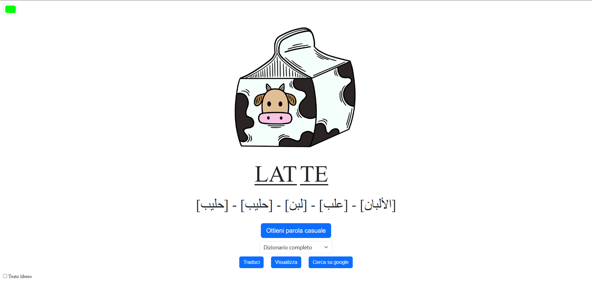

## Linguix: A Simple Tool for Teaching Italian to Arabic-Speaking Students

**Linguix** is a lightweight, user-friendly web application designed to help Arabic-speaking students learn Italian. The tool focuses on vocabulary, pronunciation, and translation, providing an interactive and engaging way to explore the Italian language. This project is intended for **charitable and non-profit purposes** and is open for anyone to use, modify, or adapt.

---


### Features

- **Random Word Extraction**: Choose a random word from the entire Italian vocabulary or from specific categories.
- **Text Syllabification**: Automatically splits Italian words or sentences into syllables for easier pronunciation.
- **Arabic Translation**: Translates words into Arabic using the Reverso API.
- **Image Support**: Displays representative images for words using Pixabay, or provides a direct link to Google Image Search.
- **Custom Input**: Users can manually input words or sentences to analyze and translate.

---

### Important Notes on Usage

- **Lightweight and Simplistic**: Linguix was built in a few days to meet a small-scale educational need. It uses simple technologies that **may not handle high traffic** or professional-grade demands.
  
- **API Usage**: The app relies on the [Reverso API](https://github.com/nire0510/reverso-api) for translations. **Excessive requests could result in an IP ban** from Reverso, which is why this tool is suitable only for low-volume, educational purposes.

- **Adaptability**: If you plan to use Linguix in a larger context, be aware that you'll need to:
  - Replace or scale up the translation API to handle more traffic.
  - Optimize the backend and frontend for broader usage.

---

### How to Run

1. **Clone the repository**:
   ```bash
   git clone git@github.com:PowerMagnum/Linguix.git
   cd linguix
   ```

2. **Install dependencies**:
   ```bash
   npm install
   ```

3. **Start the server**:
   ```bash
   node .
   ```

4. **Access the application**:
   Open your browser and go to `http://localhost:3000`.

---

### Future Improvements

If someone wants to extend this project, the following improvements are recommended:

- **Scalable Translation API**: Replace Reverso with a more robust solution for higher traffic.
- **Improved Image Search**: Integrate an image API better suited for educational or large-scale use.
- **Better Error Handling**: Add safeguards for API limits and fallback mechanisms in case of failure.
- **Expanded Language Support**: Support other language pairs beyond Italian and Arabic.
- **Modernized UI**: Enhance the user interface for better accessibility and usability.

---

### License and Usage

Linguix is an **open-source, charitable project**. Anyone can freely use, modify, or distribute the code for educational or non-commercial purposes.  

**Disclaimer**: The technologies used (e.g., Reverso API, Pixabay API) are free and simple but not designed for professional-level deployment. High traffic or misuse may result in service bans or degraded performance. If you adapt this project, ensure you assess and address these limitations. 

---

